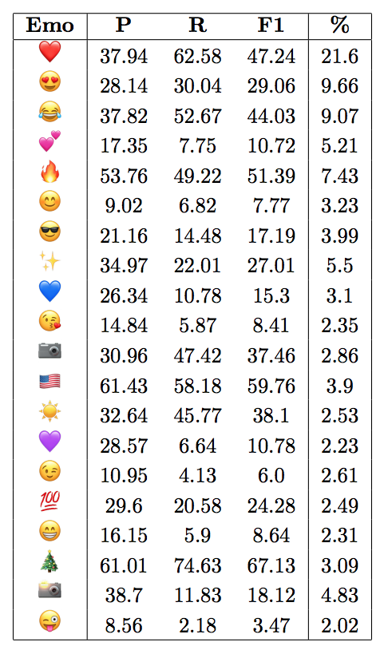
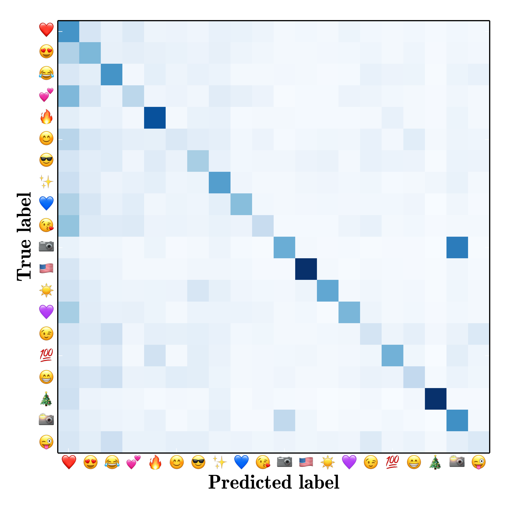

Semeval 2018 Task 2 - Detailed Results
===== 

Official results can be found [here](https://goo.gl/P515KW).

The "teams" folder of this repo includes useful files for each team ([code](https://github.com/fvancesco/Semeval2018-Task2-Emoji-Detection/tree/master/tools/detailed_results) to generate them):
* english/spanish.out.txt, best predictions submitted to the codalab page
* table.tex, the latex table with precision, recall, f1, and percentage of the test set of each emoji. You need to copy the img/ foder in the same directory of the latex project since the emoji images refer to "./img/...". Also, remember to add "\usepackage{graphicx}" to your project.
* confusion.png, confusion table of the predictions

Example of Table:

Example of Confusion Matrix:

